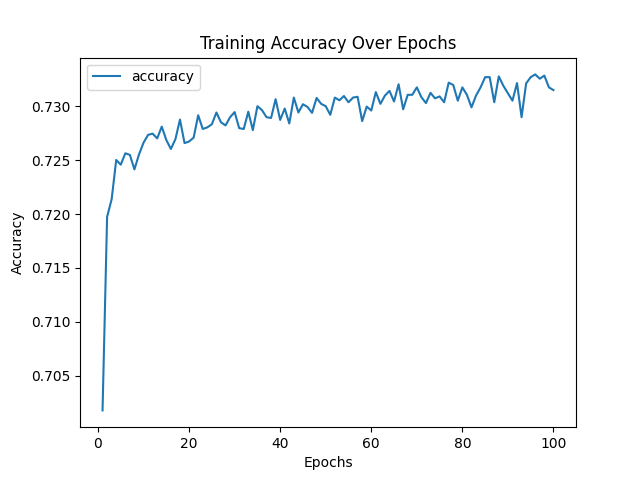
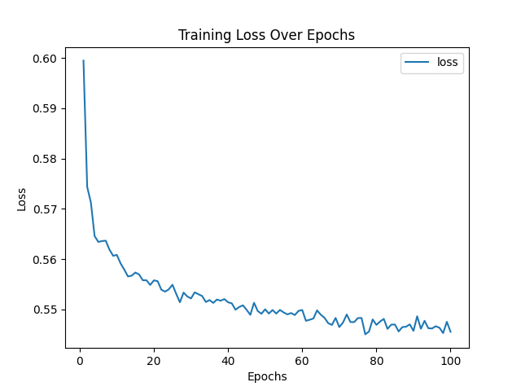

# Alphabet Soup Deep Learning Model Report

## Overview of the Analysis

The goal of this analysis was to create and evaluate a deep learning model that predicts whether applicants will successfully receive funding from Alphabet Soup. To achieve this, the data was cleaned and prepared, a neural network was designed, and different techniques were applied to improve the model’s accuracy.

## Results

### Data Preprocessing

	1.	Target Variable:
		• The target variable is IS_SUCCESSFUL, which indicates whether an applicant successfully received funding (1) or not (0).
	2.	Features:
		• The features used in the model include:
		• Numerical data like STATUS and ASK_AMT (with adjustments for better scaling).
		• Encoded values from categorical data, such as APPLICATION_TYPE and CLASSIFICATION.
	3.	Removed Data:
		• The EIN and NAME columns were removed because they were just identifiers and didn’t help the model make predictions.

### Compiling, Training, and Evaluating the Model

	1.	Model Design:
		• The model consisted of:
		• Input Layer: Takes in all the features.
		• Hidden Layers:
			• First Layer: 80 neurons with a ReLU activation function and dropout (rate=0.3) to prevent overfitting.
			• Second Layer: 50 neurons with ReLU and dropout (rate=0.2).
			• Third Layer: 20 neurons with ReLU and dropout (rate=0.2).
	 	• Output Layer: A single neuron with a sigmoid activation function to make a prediction for funding success.
	2.	Model Performance:
		• The model achieved an accuracy of 73%, which is close to the target performance (75-80%) but fell slightly short.
	3.	Steps Taken to Improve Performance:
	 	• Data Adjustments:
			• Addressed class imbalance with SMOTE, a technique that generates synthetic samples for the less common class (1 for successful funding).
			• Applied a log transformation to the ASK_AMT column to reduce its skewed distribution.
			• Simplified APPLICATION_TYPE and CLASSIFICATION by grouping smaller categories into an “Other” group.
		• Model Adjustments:
			• Tried different numbers of neurons and added a third hidden layer for more learning capacity.
			

## Summary

The deep learning model achieved reasonable accuracy (73%) and was able to predict funding success with moderate effectiveness. However, it did not fully meet the performance target, suggesting that this type of problem may be better suited to other models.

## Recommendation:
For future analysis, I recommend trying alternative models, such as XGBoost or Random Forest, which are often better suited for structured data like this. These models can:
	1.	Handle imbalanced data effectively.
	2.	Better capture complex patterns in tabular data.

To implement this, preprocess the data similarly, train one of these models, and compare their performance metrics (accuracy, precision, recall, F1-score) to the deep learning model. This would help determine the most effective approach for predicting funding success.